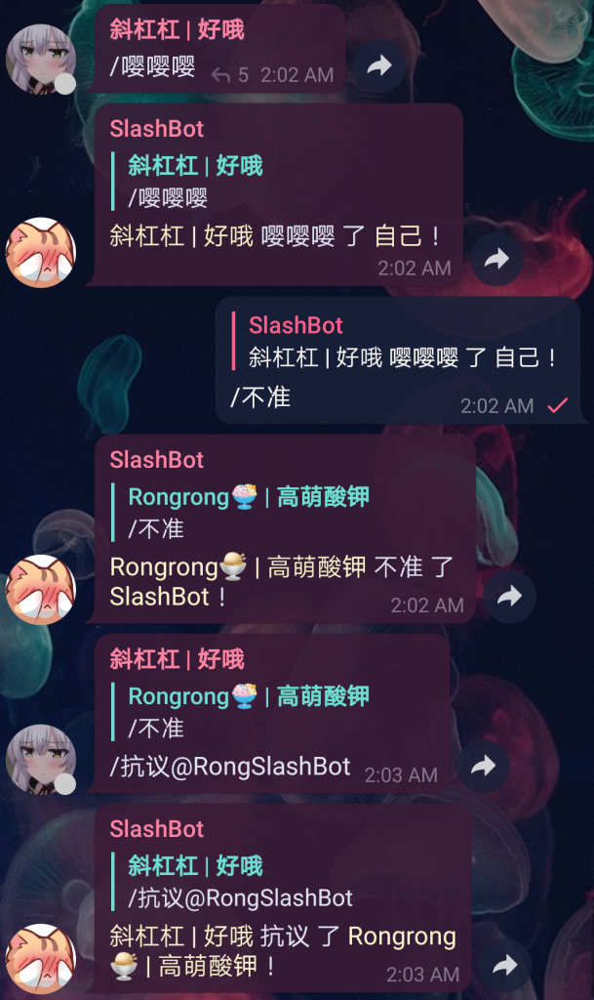

# SlashBot
[](https://hub.docker.com/r/rongronggg9/slashbot)
[](https://hub.docker.com/r/rongronggg9/slashbot)
[](https://hub.docker.com/r/rongronggg9/slashbot)
[](https://github.com/Rongronggg9/SlashBot)

**[@RongSlashBot](https://t.me/RongSlashBot)**  
**Privacy Mode on，接收不到非指令消息，保证隐私安全性。**  

由于 Telegram 限制，如您的群组已有其他 bot ，请使用 Privacy Mode off 的 [@RongSlashRBot](https://t.me/RongSlashRBot) 。  
请注意，Privacy Mode off 意味着 bot 在技术上可以收到所有消息，本 bot 已经设计为不处理及不记录任何无关消息，如您疑虑安全性，
请自行搭建或到末尾查看更多解决方案。

## Usage
```sh
docker create \
    --name [container name] \
    --restart unless-stopped \
    -e TOKEN=[bot token] \
    rongronggg9/slashbot
```
```sh
docker start [container name]
```



## 薛定谔的 Telegram Bot API
若您的群组存在大于一个 bot (含本 bot)，本 bot 可能时常无法正常工作。

症状：
[@RongSlashBot](https://t.me/RongSlashBot) 突然接收不到任何指令消息，因而也无法回复。

触发条件 (<u>需全部满足</u>)：
1. 群组内存在大于一个 bot
2. 该 bot 未被设置为管理员
3. 该 bot Privacy Mode on
4. 指令未指明目标 (如 /example)

总体上，管理员或 Privacy Mode off 的 bot 几乎一定会收到消息，其余 bot 可能收到也可能收不到消息。

**规避方法 (<u>满足任一即可</u>)：**  
1. **仅保留本 bot**
2. **将本 bot 添加为管理员（给予任一权限均可。需注意<u>该操作意味着对于本群，该 bot Privacy Mode off</u>）**
3. **换用 Privacy Mode off 的 [@RongSlashRBot](https://t.me/RongSlashRBot) (如您疑虑安全性，请自行搭建)**
4. **给指令指明目标 (如 /example@RongSlashBot)，触发成功后<u>一段时间内</u> ，不需再指明目标也可使 bot 接收到指令**
